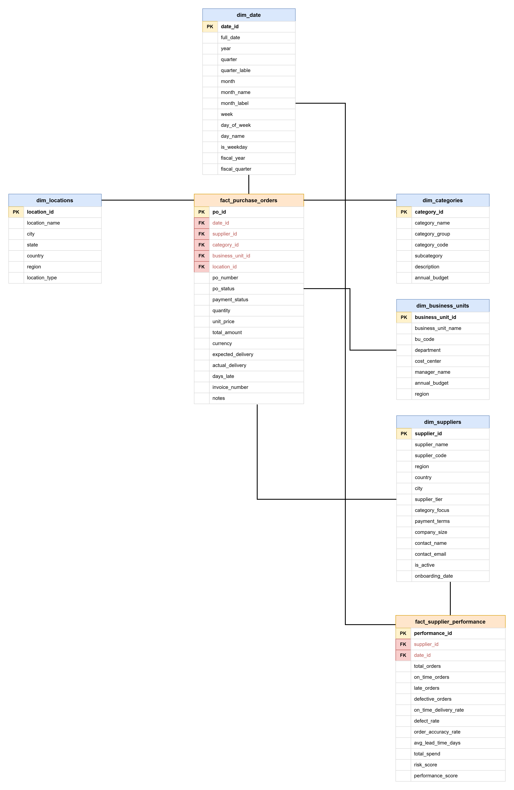

# Procurement Spend Intelligence Platform

An end-to-end procurement analytics project that demonstrates how a modern SQL data warehouse can transform purchasing transactions into actionable business intelligence.

The project simulates procurement operations for a fictional manufacturing company and follows a complete analytics workflow from dimensional data modeling and synthetic data generation through data validation, business analytics, advanced SQL analysis, and executive reporting.
**Technologies:** DuckDB • SQL • Python • VS Code • Git • GitHub

---

## Project Summary

Procurement teams generate large volumes of purchasing data every day, but raw transaction data alone provides limited value without structured analytics. Organizations need reliable reporting to understand where money is being spent, how suppliers are performing, where operational risks exist, and where procurement decisions can be optimized.

This project simulates a procurement analytics platform for **Apex Manufacturing Group (AMG)**, a fictional manufacturing company operating multiple facilities across the United States. Using a dimensional data warehouse built in DuckDB, the project transforms synthetic procurement data into business insights through structured SQL analysis.

The project follows a complete analytics lifecycle:

**Data Modeling → Database Design → Synthetic Data Generation → Data Validation → Business Analytics → Advanced SQL Analytics → Executive Reporting**

The completed warehouse contains:

**4,800** purchase orders
**993** supplier performance records
**30** suppliers
**10** procurement categories
**8** business units
**6** company locations
**3 years** of historical procurement activity (2022–2024)

The project demonstrates not only SQL proficiency, but also the analytical thinking required to design realistic business datasets, validate data quality, develop meaningful procurement KPIs, and communicate insights that support operational and strategic decision-making.

---

## Skills Demonstrated

This project was designed to demonstrate the end-to-end technical and analytical skills commonly required for Data Analyst, Business Analyst, Procurement Analyst, and Supply Chain Analyst roles.

| **Skill Area** | **Demonstrated Skills** |
|------|--------|
| **Data Modeling** | Dimensional modeling, star schema design, fact and dimension tables, primary keys, foreign keys, database constraints |
| **SQL Fundamentals** | SELECT, WHERE, GROUP BY, ORDER BY, JOINs, CASE expressions, aggregate functions |
| **Intermediate SQL** | Common Table Expressions (CTEs), subqueries, HAVING, NULL handling, multi-table joins |
| **Advanced SQL** | Window functions, RANK(), DENSE_RANK(), ROW_NUMBER(), LAG(), SUM() OVER(), AVG() OVER(), PARTITION BY, running totals, rolling averages |
| **Data Quality & Validation** | Referential integrity checks, NULL validation, business rule validation, range validation, distribution analysis, data quality scorecards |
| **Business Analytics** | Spend analysis, supplier performance analysis, payment analysis, trend analysis, category analysis, executive KPI reporting |
| **Procurement Analytics** | Supplier segmentation, spend concentration analysis, supplier risk assessment, procurement KPIs, payment health monitoring, sourcing insights |
| **Data Engineering** | Synthetic data generation, warehouse design, reusable SQL views, analytical data preparation |
| **Business Intelligence** | Executive reporting, dashboard-ready datasets, reusable analytical views, decision-support reporting |

---

## Tools & Technologies

The project was built using a focused technology stack chosen to simulate a realistic analytics workflow while keeping the implementation lightweight, reproducible, and easy to understand.

• **DuckDB 1.5.4** — analytical database engine
• **SQL** — primary language throughout
• **Python** — DuckDB connection and script execution
• **VS Code** — development environment
• **GitHub** — version control and portfolio presentation

| **Technology** | **Purpose in the Project** |
|------|--------|
| **DuckDB** | Analytical database engine used to design the data warehouse, store procurement data, and execute all SQL queries. |
| **SQL** | Primary language used for schema creation, synthetic data generation, data validation, business analytics, and advanced analytical queries. |
| **Python** | Used to connect to DuckDB, execute SQL scripts, and provide an interface for querying the warehouse. |
| **VS Code** | Primary development environment for writing, organizing, and testing SQL scripts throughout the project. |
| **Git & GitHub** | Version control, project documentation, and portfolio presentation. |

---

## Business Scenario

Procurement is a critical business function responsible for sourcing materials, managing supplier relationships, controlling purchasing costs, and ensuring that operations receive the goods and services they need on time. As organizations grow, procurement teams generate thousands of purchasing transactions that must be transformed into meaningful business insights before they can support strategic decision-making.

This project simulates the procurement analytics environment of **Apex Manufacturing Group (AMG)**, a fictional mid-sized manufacturing company operating multiple facilities across the United States. The company purchases raw materials, industrial components, logistics services, maintenance supplies, technology, and professional services from a network of approved suppliers.

Senior leadership wants greater visibility into procurement performance through a centralized analytics platform capable of answering questions such as:

• Which suppliers receive the largest share of procurement spend?
• Is procurement spend concentrated among a small number of suppliers?
• Which spending categories are growing over time?
• Which suppliers consistently deliver late or show declining performance?
• Which business units and locations drive the highest procurement costs?
• Where are potential cost-saving or supplier optimization opportunities?
• Which procurement KPIs should executives monitor on a regular basis?

The Procurement Spend Intelligence Platform was designed to answer these questions using a dimensional data warehouse, validated analytical data, and business-focused SQL reporting.

---

## Database Architecture



The Procurement Spend Intelligence Platform uses a **dimensional star schema**, a widely adopted data warehouse design optimized for analytical reporting and business intelligence workloads.

Rather than storing all procurement information in a single large table, the warehouse separates descriptive business entities (dimensions) from measurable business events (facts). This design improves query readability, simplifies reporting, reduces data redundancy, and supports efficient aggregation across multiple business perspectives.

The warehouse consists of:

• **5 Dimension Tables** containing descriptive business attributes
• **2 Fact Tables** containing measurable procurement transactions and supplier performance metrics

The diagram below illustrates the logical structure of the warehouse and the relationships between each fact table and its supporting dimensions.

```
                        dim_date
                           │
   dim_locations ──── fact_purchase_orders ──── dim_suppliers
                           │                          │
                    dim_categories          fact_supplier_performance
                           │
                   dim_business_units
```

### Dimension Tables

Dimension tables provide the business context for procurement transactions. They describe **who, what, where, and when** each purchasing event occurred, allowing analysts to aggregate procurement activity across multiple business dimensions without duplicating descriptive information.

| **Table** | **Rows** | **Business Purpose** |
|-------|------|-------------|
| `dim_date` | 1,096 | Calendar spine: Jan 2022 – Dec 2024 |
| `dim_suppliers` | 30 | Vendor registry with tier, region, payment terms |
| `dim_categories` | 10 | Spend taxonomy: Direct and Indirect categories |
| `dim_business_units` | 8 | AMG departments with annual budgets |
| `dim_locations` | 6 | Company facilities: HQ, plants, warehouse, R&D |

### Fact Tables

Fact tables store the measurable business events analyzed throughout the project. They contain procurement transactions and supplier performance metrics that support reporting, KPI calculation, trend analysis, and executive decision-making.

| **Table** | **Rows** | **Business Purpose** |
|-------|------|-------------|
| `fact_purchase_orders` | 4,800 | One row per PO: amount, status, delivery, payment |
| `fact_supplier_performance` | 993 | Monthly supplier KPIs: OTD, defect rate, risk score |

### Why a Star Schema?

A dimensional star schema was selected because it closely reflects how analytical data warehouses are designed in enterprise environments.

Compared with a single denormalized table, this approach provides several advantages:

• Simplifies analytical SQL queries through clear relationships between facts and dimensions.
• Reduces duplication of descriptive business information.
• Supports flexible reporting across suppliers, categories, business units, locations, and time.
• Improves maintainability by separating transactional data from descriptive attributes.
• Aligns with the dimensional modeling approach commonly used in modern analytical data warehouses and business intelligence platforms.

---

## Project Development Phases

The Procurement Spend Intelligence Platform was developed using a structured, phase-based methodology that mirrors the lifecycle of a real-world analytics project. Each phase was completed, validated, and reviewed before progressing to the next stage, ensuring that every analytical result was built on a reliable and well-tested foundation.

| **Phase** | **Focus Area** | **Key Deliverables** | **Status** |
|-------|-------------|--------|-------|
| Phase 1 | Project Planning | Defined the business scenario, procurement domain, project objectives, and analytics roadmap. |✅ Complete |
| Phase 2 | Dimensional Data Modeling | Designed the star schema, identified fact and dimension tables, and established analytical relationships. |✅ Complete |
| Phase 3 | Database Implementation | Built the warehouse schema with primary keys, foreign keys, constraints, and indexes using DuckDB. |✅ Complete |
| Phase 4 | Synthetic Data Generation | Generated realistic procurement transactions and supplier performance data following defined business rules. |✅ Complete |
| Phase 5 | Data Quality Validation | Verified data completeness, referential integrity, business rules, distributions, and overall warehouse quality. |✅ Complete |
| Phase 6 | Business Analytics | Developed procurement reporting, KPI analysis, supplier performance evaluation, spend analysis, and executive reporting queries. |✅ Complete |
| Phase 7 | Advanced SQL Analytics | Applied advanced SQL techniques including window functions, Pareto analysis, rolling averages, risk scoring, and reusable analytical views. |✅ Complete |
| Portfolio Polish | Documentation & Presentation | Refined SQL documentation, improved repository organization, created project documentation, and prepared the project for GitHub publication. |✅ Complete |

### Project Progression

```
Business Problem
        ↓
Data Modeling
        ↓
Database Design
        ↓
Synthetic Data Generation
        ↓
Data Validation
        ↓
Business Analytics
        ↓
Advanced SQL Analytics
        ↓
Repository Documentation
        ↓
Portfolio Presentation
```

---

## Repository Structure

The repository is organized to reflect the development lifecycle of the project. SQL scripts are separated by project phase, making it easy to follow the progression from database design through advanced analytics.

The recommended reading order follows the same sequence used during development.

```
procurement-spend-intelligence/
│
├── database/
│   └── procurement.duckdb
│
├── docs/
│   ├── company_profile.md
│   ├── data_model_notes.md
│   └── schema_decisions.md
│
├── sql/
│   ├── schema.sql
│   ├── data_generation.sql
│   ├── validation.sql
│   ├── spend_analysis.sql
│   └── phase7_advanced_analytics.sql
│
├── er_diagram/
│   ├── er_diagram.drawio
│   ├── er_diagram.png
│   └── er_diagram.svg
│
│
├── README.md
├── LICENSE
└── .gitignore
```

### SQL Scripts

| **File** | **Purpose** |
|------|--------|
| **schema.sql** | Creates the dimensional data warehouse, including all fact tables, dimension tables, constraints, and indexes. |
| **data_generation.sql** | Populates the warehouse with realistic synthetic procurement transactions and supplier performance records. |
| **validation.sql** | Verifies data integrity, business rules, distributions, and overall warehouse quality before analytical reporting begins. |
| **spend_analysis.sql** | Performs business-focused procurement analysis, including spend reporting, supplier analysis, payment analysis, and executive KPIs. |
| **phase7_advanced_analytics.sql** | Demonstrates advanced SQL techniques including window functions, Pareto analysis, rolling averages, risk scoring, and reusable analytical views. |

### Recommended Reading Order

For readers interested in understanding how the project was developed, the SQL scripts are intended to be explored in the following order:

1. schema.sql – Understand the dimensional warehouse design.
2. data_generation.sql – See how realistic procurement data was generated.
3. validation.sql – Review the data quality and validation process.
4. spend_analysis.sql – Explore the core business analytics.
5. phase7_advanced_analytics.sql – Review advanced SQL techniques and executive analytics.

### What This Repository Demonstrates

By working through the repository, readers will see how a procurement analytics solution can be developed from the ground up using a structured engineering approach:

• Designing a dimensional data warehouse.
• Building a relational database schema.
• Generating realistic synthetic business data.
• Validating data quality before analysis.
• Developing business-focused SQL reports.
• Applying advanced analytical SQL techniques.
• Preparing reusable analytical datasets for reporting and decision support.
• Documenting the project for professional portfolio presentation.

---

## Key Analytical Findings

The following insights were generated from the validated procurement warehouse using business-focused SQL analysis. Each finding represents a realistic procurement question that organizations may investigate to improve supplier performance, control costs, and support strategic decision-making.

### 1. Supplier Spend Concentration

**Finding**

Procurement spend is concentrated among a relatively small number of suppliers, indicating that a limited portion of the supplier base represents a significant share of total purchasing activity.

**Business Impact**

This insight helps procurement teams identify supplier dependency risk, prioritize strategic supplier relationships, and evaluate opportunities for supplier diversification.

**SQL Techniques**

DENSE_RANK(), window functions, cumulative spend analysis, Pareto analysis.

### 2. Supplier Performance Deterioration

**Finding**

Several suppliers demonstrated measurable declines in operational performance over the available reporting period, particularly in on-time delivery metrics.

**Business Impact**

Early identification of declining supplier performance allows procurement teams to initiate corrective actions, reduce operational risk, and strengthen supplier management strategies before performance issues become more significant.

**SQL Techniques**

Time-series analysis, first-versus-last available observation methodology, trend analysis.

### 3. Procurement Spend by Business Unit

**Finding**

Manufacturing-related business units account for the largest share of procurement spend, reflecting the operational priorities of a production-focused organization.

**Business Impact**

Understanding how procurement spend is distributed across business units helps leadership allocate budgets, evaluate purchasing efficiency, and identify areas for cost optimization.

**SQL Techniques**

GROUP BY aggregation, dimensional analysis, percentage calculations.

### 4. High-Spend Supplier Risk Assessment

**Finding**

Combining procurement spend with supplier performance metrics identified suppliers that represent both significant purchasing investment and elevated operational risk.

**Business Impact**

This analysis enables procurement teams to prioritize supplier reviews, develop mitigation strategies, and focus improvement efforts where business impact is greatest.

**SQL Techniques**

Composite risk scoring, weighted KPI calculations, multi-table joins.

### 5. Direct vs. Indirect Procurement Spend

**Finding**

Direct procurement categories consistently represent the majority of organizational purchasing activity, reflecting the purchasing profile of a manufacturing business.

**Business Impact**

Separating direct and indirect procurement spend supports budgeting, sourcing strategy, supplier negotiations, and long-term procurement planning.

**SQL Techniques**

Conditional aggregation, CASE expressions, annual trend analysis.

### 6. Payment Status and Financial Exposure

**Finding**

Analysis of invoice payment status identified procurement-related financial obligations requiring continued monitoring by procurement and finance teams.

**Business Impact**

Monitoring overdue and disputed payments helps improve cash flow planning, strengthen supplier relationships, and reduce financial risk.

**SQL Techniques**

Aggregation, payment status analysis, financial KPI reporting.

### Summary of Business Insights

| **Business Area** | **Primary Insight** |
|------|--------|
| **Supplier Management** | Procurement spend is concentrated among a relatively small number of suppliers. |
| **Supplier Performance** | Several suppliers showed measurable performance deterioration over time. |
| **Spend Analysis** | Manufacturing operations account for the largest share of procurement spend. |
| **Risk Management** | High-spend suppliers with declining performance require closer monitoring. |
| **Procurement Strategy** | Direct procurement categories dominate purchasing activity. |
| **Financial Management** | Payment analysis highlights areas requiring continued financial oversight. |

---

## Advanced SQL Techniques Demonstrated

The project applies a range of SQL techniques commonly used in analytical reporting, business intelligence, and decision-support systems. Each technique was implemented to solve a realistic procurement analytics problem rather than simply demonstrate SQL syntax.

| **SQL Technique** | **Business Application** |
|------|--------|
| **CTEs (Common Table Expressions)** | Break complex analytical queries into clear, modular steps for improved readability and maintenance. |
| **Window Functions** | Perform rankings, cumulative calculations, and trend analysis without collapsing row-level detail. |
| **RANK(), DENSE_RANK(), ROW_NUMBER()** | Compare supplier performance, identify top-performing suppliers, and analyze rankings within business groups. |
| **LAG()** | Measure changes over time for year-over-year analysis and supplier performance trends. |
| **Running Totals** | Track cumulative procurement spend and support Pareto analysis. |
| **Rolling Averages** | Smooth short-term fluctuations when evaluating supplier performance trends. |
| **CASE Expressions** | Categorize procurement data and create business-friendly reporting metrics. |
| **Conditional Aggregation** | Compare direct vs. indirect spend, payment status, and category performance within a single query. |
| **Reusable SQL Views** | Create reusable analytical SQL views that can be used across reports and business intelligence tools. |

### Technical Highlights

The project demonstrates SQL techniques frequently used in enterprise analytics, including:

• Analytical window functions
• Multi-stage query design with CTEs
• Business-focused aggregations
• Time-series trend analysis
• Executive KPI reporting
• Reusable analytical SQL views
• Procurement risk analysis

---

## Key Data Design Decisions

The project incorporates several design decisions commonly found in analytical data warehouses. Each decision was made to improve data quality, reporting flexibility, maintainability, or analytical performance.

### 1. Dimensional Star Schema

**Design Decision**

The warehouse was modeled using a dimensional star schema with separate fact and dimension tables.

**Reason**

Star schemas simplify analytical queries by separating measurable business events from descriptive business attributes.

**Business Benefit**

This structure supports flexible reporting across suppliers, categories, business units, locations, and time while remaining compatible with modern business intelligence tools such as Power BI.

### 2. Integer Date Keys

**Design Decision**

Dates are stored as integer surrogate keys (YYYYMMDD) rather than calculated during query execution.

**Reason**

Using integer date keys simplifies joins with the date dimension and supports efficient time-based filtering.

**Business Benefit**

Enables consistent reporting across years, quarters, and months while supporting scalable analytical queries.

### 3. Separate Supplier Performance Fact Table

**Design Decision**

Supplier operational KPIs were modeled in a dedicated fact table independent of purchase order transactions.

**Reason**

Supplier performance metrics are measured over time and represent a different business process than individual purchasing transactions.

**Business Benefit**

Supports trend analysis, supplier scorecards, risk assessment, and KPI reporting without duplicating transactional data.

### 4. Pre-Calculated Delivery Metrics

**Design Decision**

Delivery delay metrics were calculated during data generation rather than during every analytical query.

**Reason**

Pre-computed business metrics simplify analytical SQL and reduce repetitive calculations.

**Business Benefit**

Improves query readability while allowing analysts to focus on business insights instead of repetitive calculation logic.

### Architecture Summary

| **Design Decision** | **Primary Objective** |
|------|--------|
| **Dimensional Star Schema** | Flexible analytical reporting |
| **Integer Date Keys** | Consistent time-based analysis |
| **Separate Supplier Performance Fact Table** | Independent KPI and trend reporting |
| **Pre-Calculated Delivery Metrics** | Simpler analytical SQL and reusable business metrics |

---

## Dataset Overview

The synthetic dataset was designed to simulate a realistic procurement environment for a mid-sized manufacturing organization. It includes suppliers, procurement categories, business units, company locations, and three years of historical purchasing activity to support analytical reporting and business intelligence.

### Supplier Distribution

| **Supplier Tier** | **Suppliers** | **Typical Business Role** |
|------|-------|------------|
| Strategic | 5 | Long-term suppliers supporting critical business operations |
| Preferred | 11 | Primary suppliers used for regular procurement activities |
| Approved | 11 | Qualified suppliers available for operational purchasing |
| Spot | 3 | Suppliers used for specialized or occasional purchases |

### Procurement Categories

| **Category Type** | **Categories** |
|------|--------|
| **Direct Procurement** | Raw Materials, Packaging, Industrial Components, Chemicals & Consumables, Capital Equipment |
| **Indirect Procurement** | Logistics & Freight, MRO, IT Hardware & Software, Professional Services, Facilities & Utilities |

### Dataset Summary

| **Component** | **Value** |
|------|--------|
| **Purchase Orders** | 4,800 |
| **Supplier Performance Records** | 993 |
| **Suppliers** | 30 |
| **Procurement Categories** | 10 |
| **Business Units** | 8 |
| **Company Locations** | 6 |
| **Historical Period** | 2022–2024 |

### Why This Dataset?

The dataset was intentionally designed to balance realism with analytical simplicity. Rather than replicating a full enterprise ERP system, it focuses on the procurement entities and business processes necessary to demonstrate dimensional modeling, SQL analytics, supplier performance analysis, and executive reporting.

---

## How to Run

The project is designed to be executed sequentially, following the same workflow used during development. Each SQL script builds upon the previous phase, ensuring that the data warehouse is fully prepared before business analytics and advanced SQL reporting are performed.

### Prerequisites

| **Requirement** | **Version** |
|------|--------|
| **DuckDB** | 1.5.x or later |
| **Python** | 3.8 or later |
| **Git** | Any recent version |
| **VS Code (recommended)** | Latest version |

```bash
# Clone the repository
git clone https://github.com/tejas-jaggi/procurement-spend-intelligence.git

# Navigate into the project
cd procurement-spend-intelligence

# Create the data warehouse
duckdb database/procurement.duckdb < sql/schema.sql

# Generate synthetic procurement data
duckdb database/procurement.duckdb < sql/data_generation.sql

# Validate warehouse quality
duckdb database/procurement.duckdb < sql/validation.sql

# Run business analytics
duckdb database/procurement.duckdb < sql/spend_analysis.sql

# Run advanced SQL analytics
duckdb database/procurement.duckdb < sql/phase7_advanced_analytics.sql
```

### Query the Warehouse with Python

The warehouse can also be queried programmatically using Python and the DuckDB client library, making it easy to integrate SQL analysis into notebooks, applications, or future analytical workflows.

```python
import duckdb
conn = duckdb.connect('database/procurement.duckdb')
result = conn.execute("SELECT * FROM v_executive_kpi").fetchdf()
print(result)
```

### Expected Workflow

For the best experience, execute the project in the following order:

1. Create the data warehouse.
2. Generate the synthetic procurement dataset.
3. Validate data quality and business rules.
4. Explore business analytics.
5. Review advanced SQL analytics and executive reporting queries.

---

## Lessons Learned

Developing this project reinforced several important principles of analytical engineering and business intelligence:

• **Data quality should always be validated before analysis.** Building Phase 5 demonstrated that reliable business insights depend on trustworthy data rather than complex SQL alone.
• **Good data modeling simplifies downstream analytics.** Investing time in designing a dimensional star schema made later reporting and dashboard development significantly easier.
• **Business understanding is as important as technical implementation.** Every analytical query was designed to answer a realistic procurement question rather than simply demonstrate SQL syntax.
• **Advanced SQL is most valuable when solving real business problems.** Window functions, ranking techniques, and reusable views were implemented to support meaningful reporting rather than showcase individual SQL features.
• **Iterative development produces stronger analytical solutions.** Building, validating, reviewing, and refining each phase before moving forward resulted in a more reliable and maintainable project.

---

## Future Enhancements

Possible future extensions include:

• Develop interactive Power BI dashboards for executive procurement reporting.
• Automate data generation and warehouse refresh using Python workflows.
• Introduce incremental data loading to simulate ongoing procurement operations.
• Expand the supplier risk model with additional operational and financial indicators.
• Implement automated data quality testing as part of the warehouse refresh process.
• Deploy the solution using a cloud-based analytical database platform.

---

## About the Author

**Tejas Jaggi**
MS Information Management — University of Illinois Urbana-Champaign (May 2027)

If you'd like to discuss this project or connect professionally, feel free to reach out.

• [GitHub](https://github.com/tejas-jaggi) 
• [Portfolio](https://tejas-jaggi.github.io/)
• [LinkedIn](https://www.linkedin.com/in/tejas-jaggi/)
